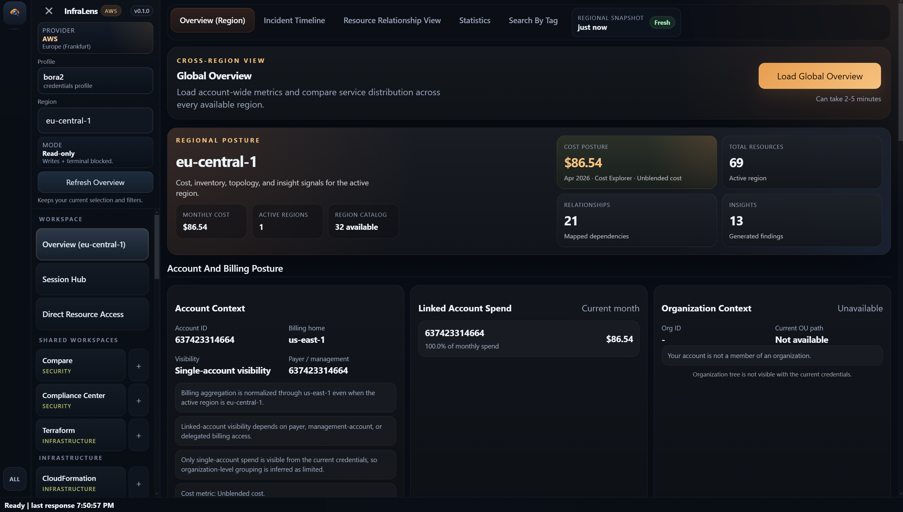
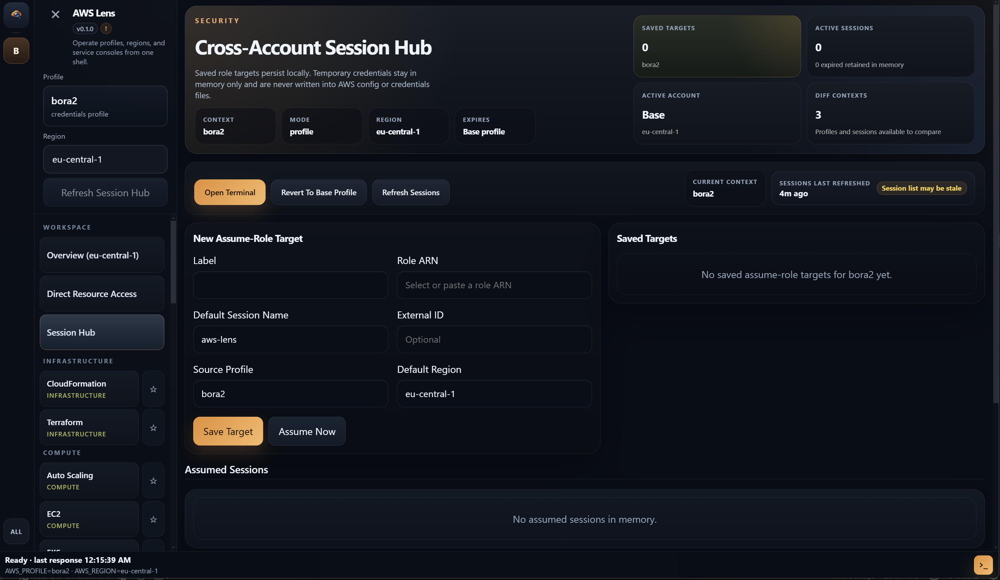
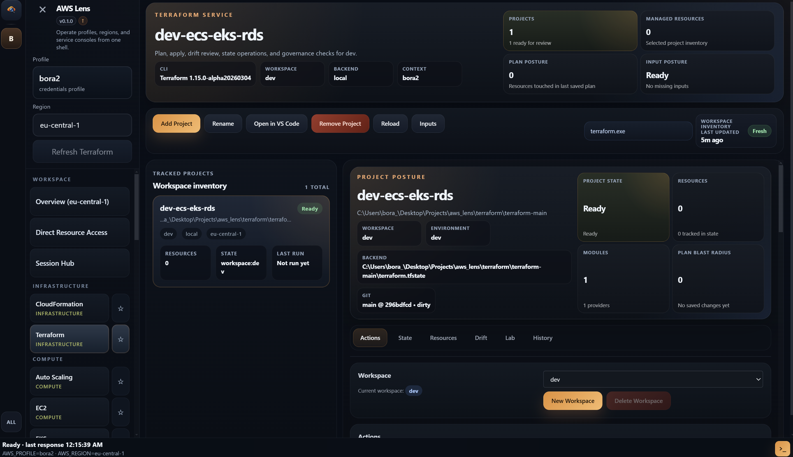
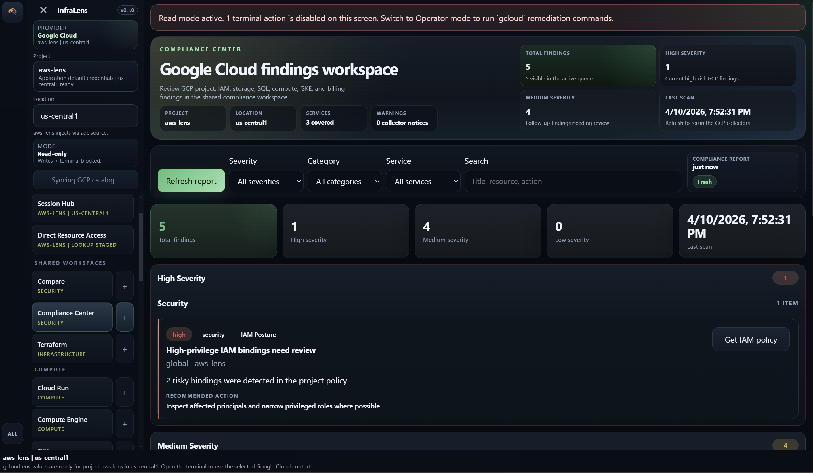
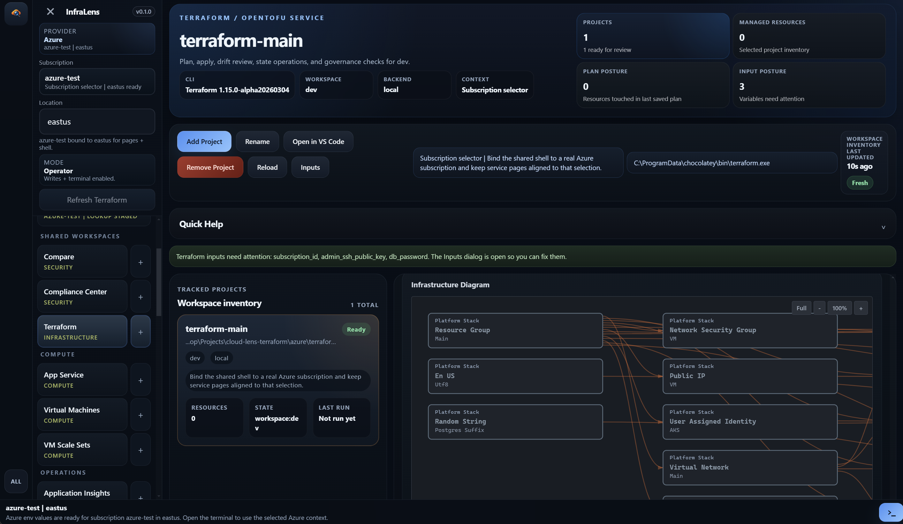

# InfraLens



InfraLens is a desktop app for cloud teams who are tired of splitting the same job across cloud consoles, Terraform files, and terminal tabs. It gives you one place to inspect infrastructure, understand context, compare environments, and take the next step without constantly rebuilding your mental model.

## The Problem It Solves

Managing infrastructure usually means jumping between too many surfaces.

- You open a cloud console to inspect a resource.
- You switch to Terraform to check whether it is managed.
- You open a terminal to run the next command.
- You lose account, region, project, or subscription context along the way.

InfraLens is built for that gap. It is not just another console clone and it is not just a Terraform wrapper. It is the layer in between, where operators actually spend time figuring out what exists, what changed, what is risky, and what to do next.



## What InfraLens Feels Like

InfraLens keeps the operational flow in one place.

- Start from a high-level overview instead of a blank terminal.
- Move from shared workspaces into provider-specific services without losing context.
- Compare environments side by side when something looks off.
- Keep Terraform close to the live resource view instead of treating it as a separate world.
- Use the built-in terminal with the active provider context already in place.

That makes it easier to investigate incidents, review posture, trace drift, and work across multiple cloud environments without the usual tab sprawl.

## Who It Is For

InfraLens is aimed at:

- platform engineers
- cloud operators
- DevOps and SRE teams
- people who work across AWS, Google Cloud, Azure, and Terraform in the same day

If your work is mostly "find the resource, understand the state, verify the IaC story, then act," this is the workflow the app is trying to improve.



## What You Can Do With It

- Explore cloud resources through provider-aware workspaces instead of starting from raw CLI output.
- Keep shared surfaces like Overview, Session Hub, Compare, and Compliance Center above individual service pages.
- Work across AWS, Google Cloud, and Azure in the same product.
- Bring Terraform and OpenTofu into the same operating flow as console inspection.
- Use local toolchain and provider context without stitching everything together manually.

AWS currently has the deepest service coverage in the repository. Google Cloud and Azure are also part of the current product direction, with dedicated workspaces and provider-aware flows already in place.





## Why Multi-Cloud Matters Here

InfraLens is not trying to flatten every provider into the same generic UI. The point is to keep a consistent operating model while still respecting provider-specific context.

You should be able to move between:

- AWS accounts and regions
- Google Cloud projects and locations
- Azure subscriptions and tenants
- Terraform workspaces and plans

without feeling like you are switching products every few minutes.

## For Contributors

This repository uses `pnpm` and the current release workflow targets Node.js `22` with `pnpm` `10`.

```powershell
pnpm install
pnpm dev
```

Useful verification commands:

```powershell
pnpm typecheck
pnpm build
```

Contributor guidance lives in [CONTRIBUTING.md](CONTRIBUTING.md). Deeper workflow notes live in [docs/](docs/).
