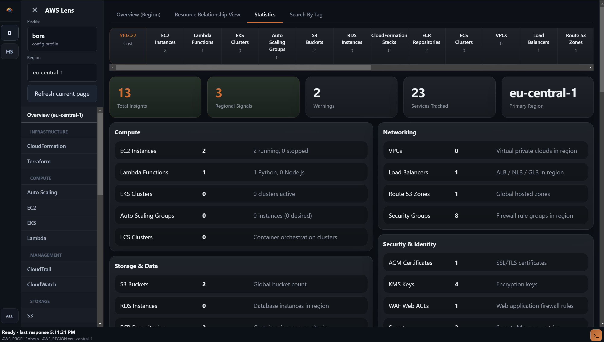
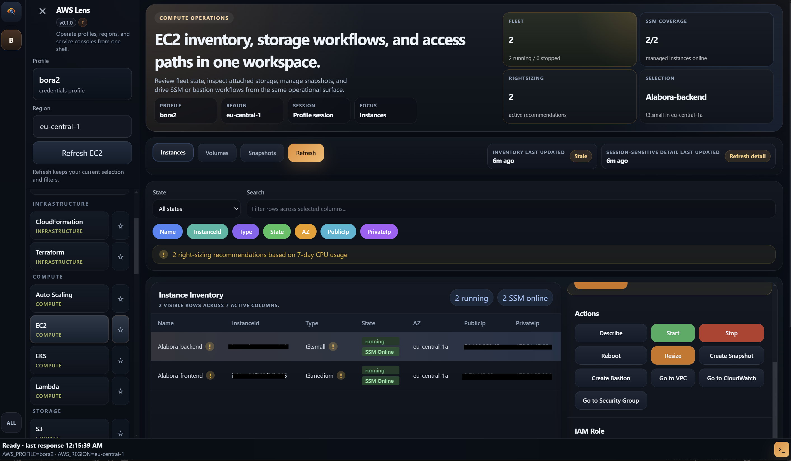
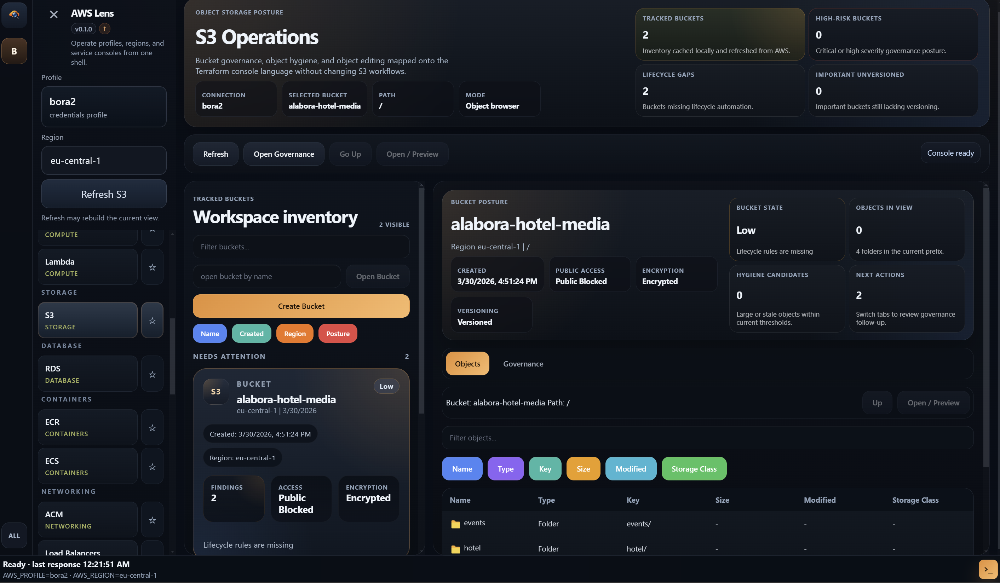
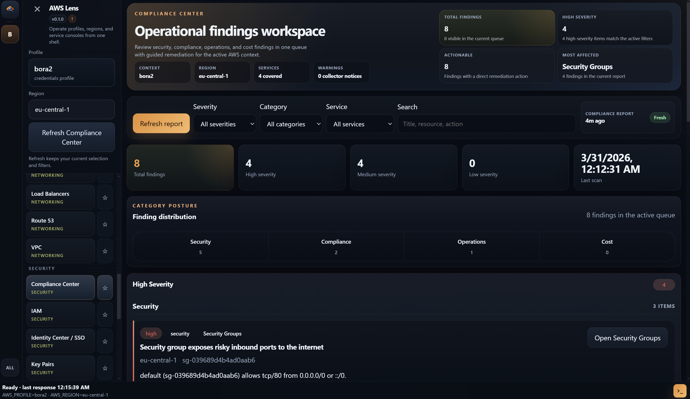

# Cloud Lens

Cloud Lens is an Electron desktop app for cloud operators who want the provider console view, Terraform context, and a working terminal in the same place. The codebase already uses the `Cloud Lens` brand, while some repository, package, and installer metadata still carry `AWS Lens` or `aws-lens` during the rename migration.



## What The App Covers

The current product is centered on AWS, with GCP now wired into the same navigation and terminal model as an active preview surface. Azure groundwork exists in the repository, especially around provider abstractions and terminal handoff, but it is not a production-ready UI surface yet.

Most of the day-to-day flow starts in a small set of shared workspaces rather than a single provider page. `Overview`, `Session Hub`, `Terraform`, `Compare`, and `Compliance Center` sit above the individual service consoles so you can keep context while moving between inspection, shell work, and infrastructure changes.


## What It Is Good At

The app is strongest when the job is not purely “click around a console” and not purely “stay in Terraform.” It is built for the in-between work: inspect a resource, check whether Terraform owns it, keep the same session and region, run the next command, and avoid rebuilding context each time.

On the AWS side, the repository already contains dedicated consoles for EC2, CloudWatch, CloudTrail, S3, Lambda, RDS, CloudFormation, ECR, EKS, ECS, VPC, Route 53, IAM, Identity Center, Secrets Manager, KMS, SNS, SQS, WAF, STS, key pairs, and related shared workflows. The same shell also includes local encrypted storage for app-managed credentials, session state, comparison baselines, and Terraform metadata, along with `operator` and `read-only` runtime modes.





## Terraform In The Loop

Terraform is treated as a first-class operational surface, not an external tool that happens to live next to the app. The Electron main process handles project registration, workspace switching, plan and apply orchestration, drift inspection, governance checks, adoption/import flows, and state-related metadata. The code also supports choosing Terraform or OpenTofu and storing local tool path overrides in app settings.


## Security And Operations

The app keeps privileged behavior on the Electron main-process side and exposes renderer functionality through the preload bridge. App-created credentials are stored in the local encrypted vault instead of being written back into provider credential files, assumed-role session material stays scoped to the app flow, and critical actions can be blocked entirely when the runtime is set to `read-only`.

The compliance and diagnostics surfaces are part of that same operational model. Alongside the service consoles, the repository includes audit export, diagnostics bundles, update checks, and environment/toolchain detection for local operator workflows.



## Running It Locally

This repository uses `pnpm`. The release workflow in `.github/workflows/release.yml` builds with Node.js `22` and `pnpm` `10`, so that is the safest local baseline if you want parity with CI packaging.

```powershell
pnpm install
pnpm dev
```

For normal development, the main verification commands are `pnpm typecheck` and `pnpm build`. Packaged builds are produced with `pnpm dist`, or with the platform-specific variants `pnpm dist:win`, `pnpm dist:mac`, and `pnpm dist:linux`.

The optional local tooling depends on which workflows you actually use. Terraform or OpenTofu matters for infrastructure workspaces, local AWS credentials matter for AWS flows, `gcloud` plus ADC matters for GCP flows, and tools such as `kubectl` and `docker` become useful once you lean on cluster and runtime helper flows.

## Project Shape

The repository is split along standard Electron boundaries. `src/main/` contains the privileged process code, IPC handlers, provider integrations, Terraform orchestration, diagnostics, release checks, and local persistence. `src/preload/` exposes the secure bridge with `contextBridge`. `src/renderer/src/` contains the React UI for the shared workspaces, AWS consoles, and current GCP pages. Shared branding, feature flags, provider descriptors, and contracts live in `src/shared/`, while packaging assets live in `assets/` and longer workflow notes live in `docs/`.

There is no dedicated automated test suite in the repository yet. The current contributor guidance in `CONTRIBUTING.md` expects local verification with `pnpm typecheck`, `pnpm build` when relevant, and manual validation in `pnpm dev`.

## Further Reading

The `docs/` directory covers the operating model in more detail, especially around [AWS usage and security](docs/aws-lens-usage.md), [Session Hub](docs/session-hub-usage.md), [Terraform workspace management](docs/terraform-workspace-management.md), [Terraform drift reconciliation](docs/terraform-drift-reconciliation.md), [Terraform state operations center](docs/terraform-state-operations-center.md), and the [observability and resilience lab](docs/observability-and-resilience-lab.md).
